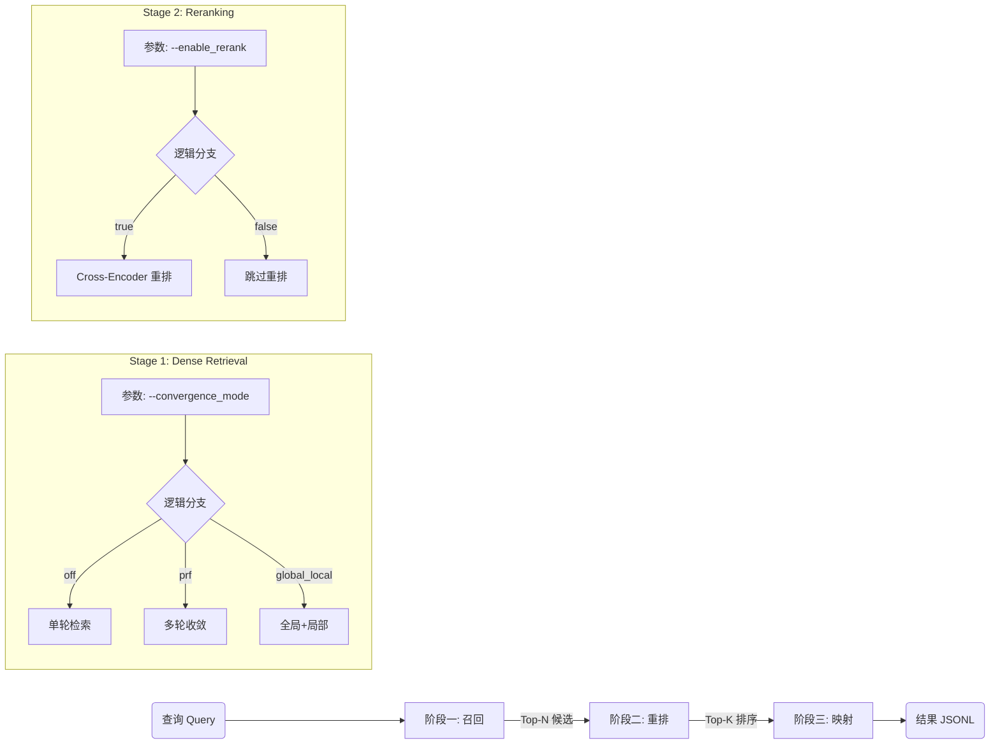

# run_with_index_convergent.py 大一统检索器设计文档

适用范围：`method/retrieval/run_with_index_convergent.py`  
当前阶段目标：先完成设计，不改代码。

## 1. 设计约束（必须满足）

1. 只在 `method/retrieval/run_with_index_convergent.py` 上演进。
2. 不新增第二个评测入口脚本。
3. 通过 CLI 参数组合覆盖不同实验场景。
4. 保持输出格式不变：`loc_outputs.jsonl`（`instance_id/found_files/found_modules/found_entities/raw_output_loc`）。
5. 失败可回退（fail-open），不能因为重排故障破坏原检索可用性。

## 2. 总体架构：串行流水线

## 3. 参数组合与实验场景

| 场景 | `--convergence_mode` | `--enable_rerank` | 说明 |
|---|---|---|---|
| Baseline | `off` | `false`（默认） | 最快的单轮向量检索 |
| 仅 PRF | `prf` | `false` | 仅做向量空间多步收敛 |
| 仅 Rerank | `off` | `true` | 单轮召回后做 CE 精排 |
| 完全体 | `prf` | `true` | 先扩召回，再精排 |

说明：`global_local + rerank` 作为第五种扩展场景，保留可选，不影响上表四个核心实验。

## 4. 单脚本内的逻辑分层

建议在同一文件中保持以下职责边界（函数级拆分，不拆文件）：

1. `retrieve_candidates(...)`  
   输入 query 与索引，按 `convergence_mode` 返回统一的 `block_scores`。
2. `maybe_rerank(...)`  
   由 `enable_rerank` 决定是否重排；输出同结构 `block_scores`。
3. `map_and_format_output(...)`  
   使用既有映射逻辑产出 `found_files/found_modules/found_entities`。

这样主循环就固定为：

1. Stage-1：`retrieve_candidates`
2. Stage-2：`maybe_rerank`
3. Stage-3：`map_and_format_output`

## 5. 参数设计（大一统版本）

## 5.1 召回相关（已存在）

保留现有参数族：

1. `--convergence_mode {off,prf,global_local}`
2. `--max_steps`
3. `--top_k_blocks_expand`
4. `--feedback_top_m`
5. `--feedback_file_cap`
6. `--query_update_alpha`
7. `--query_anchor_beta`
8. `--feedback_temp`
9. `--round_fusion {last,rrf}`
10. `--rrf_k`
11. `--converge_jaccard_*`
12. `--top_k_seed_files`

## 5.2 重排相关（新增）

建议新增（命名按你要求）：

1. `--enable_rerank`（`store_true`）
2. `--rerank_model`（默认：`cross-encoder/ms-marco-MiniLM-L-6-v2`）
3. `--rerank_top_k`（默认：`50`）

建议补充的工程参数（防止后续返工）：

1. `--rerank_batch_size`（默认：8）
2. `--rerank_max_length`（默认：512）
3. `--rerank_context_lines`（默认：0）
4. `--rerank_fusion {replace,linear}`（默认：`replace`）
5. `--rerank_weight`（默认：0.8，`linear` 时生效）
6. `--rerank_fail_open`（默认：true）

## 6. 三步改造方案（仅文档，不落代码）

## 6.1 第一步：参数定义

在 `parse_args()` 里合并两套参数：

1. Dense/PRF 参数（保持现有不破坏）。
2. Rerank 参数（新增参数组）。

关键点：

1. 默认行为不变：`--enable_rerank` 不传时，脚本行为等价当前版本。
2. 参数冲突校验：`rerank_top_k <= len(block_scores)` 自动截断。

## 6.2 第二步：模型加载

1. Dense 编码模型：始终加载（当前已有）。
2. Cross-Encoder：仅在 `enable_rerank=true` 时加载。
3. 重排器加载失败处理：
   - 若 `rerank_fail_open=true`，打印 warning 并回退为“无重排”。
   - 若 `false`，直接报错退出。

## 6.3 第三步：主循环整合

主循环固定串行：

1. `block_scores = retrieve_candidates(...)`
2. `block_scores = maybe_rerank(...)`
3. `found_files/modules/entities = map(...)`

其中 `maybe_rerank` 内部逻辑：

1. 取 `top_k_candidates = block_scores[:rerank_top_k]`
2. 构造 `(query, snippet)` 对并调用 CE 打分
3. 产出 `reranked_top_k`
4. 拼回尾部：`block_scores = reranked_top_k + rest_candidates`

## 7. 代码片段回源规范（Rerank 必需）

由于 dense metadata 不含原文，重排时必须回源读文件：

1. 路径：`repos_root / repo_name / file_path`
2. 行号：`start_line/end_line` 视为 0-based 且闭区间
3. 上下文扩展：`rerank_context_lines` 前后补齐
4. 超长截断：按 `rerank_max_length` 或最大行数截断

## 8. 关键不变性（防回归）

1. 输出 JSON schema 不变。
2. `--convergence_mode off --enable_rerank false` 结果应与当前行为一致（或仅有浮点微差）。
3. 任何 rerank 异常不应污染后续映射阶段（fail-open 模式）。

## 9. A/B 实验模板（同一脚本）

公共参数固定后，仅改两个开关：

1. Baseline：`--convergence_mode off`
2. PRF：`--convergence_mode prf`
3. Rerank：`--convergence_mode off --enable_rerank --rerank_model ...`
4. 完全体：`--convergence_mode prf --enable_rerank --rerank_model ...`

推荐额外记录：

1. Stage1 耗时
2. Rerank 耗时
3. 总耗时
4. Hit@K 与空结果率

## 10. 实施顺序建议

1. 先打通 `off + rerank`（最小闭环）。
2. 再接入 `prf + rerank`。
3. 最后验证 `global_local + rerank`。

## 11. 验收标准

1. 单脚本可覆盖四类核心场景（Baseline / PRF / Rerank / 完全体）。
2. 默认参数下行为兼容旧版。
3. 重排开关不影响未开启时性能。
4. 文档中的命令组合可直接复现结果。
